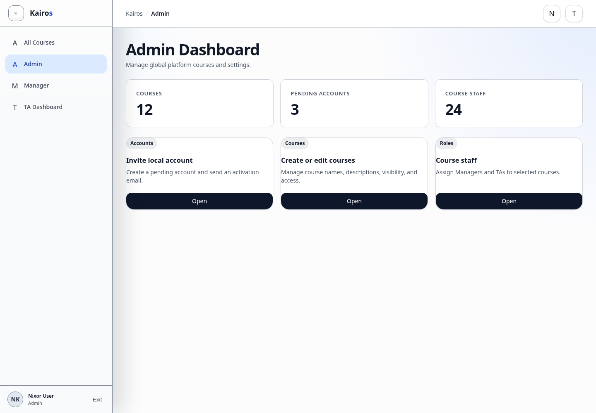

# Admin dashboard overview

## What this is for

Use the Admin area to manage courses, invited accounts, course settings, and course staff.

## How to do it

1. Select **Admin** from the Kairos menu.
2. Review pending local accounts.
3. Use **All Courses** to select a course.
4. Use **Create course** or **Edit selected course** when needed.
5. Review course visibility and access settings.
6. Use **Course staff** to assign Managers and TAs.

## Screenshot

## Notes

- Only Admins can open the Admin area.
- Check the selected course before changing settings or staff.
- Course deletion is a high-impact action and should be used carefully.
