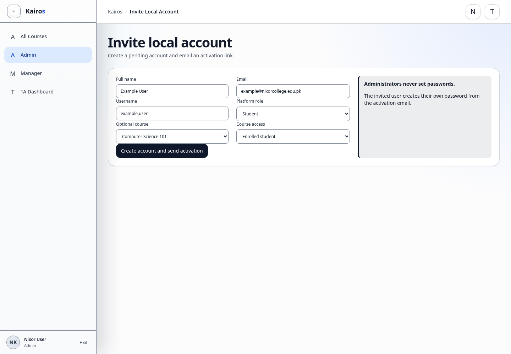

# Creating users

## What this is for

Help a new person access Kairos using Google or an Admin-invited password account.

## How to do it

1. For a Nixor Google user, ask them to sign in to Kairos with their `@nixorcollege.edu.pk` account.
2. Confirm that their Kairos account appears after the first successful sign-in.
3. For a password account, use **Invite local account**.
4. Choose the correct platform role and optional course access.
5. Send the invitation and ask the user to activate the account from email.

## Screenshot

## Notes

- Only Admins can invite password-account users.
- Admins do not set or view the user's password.
- Use the lowest role that gives the person the access they need.

## Troubleshooting

- If a Google user cannot sign in, confirm they selected the correct Nixor account.
- If the invitation email fails, use the pending-account resend action.
