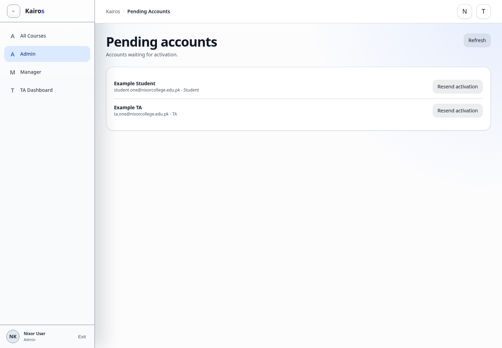

# Resending activation links

## What this is for

Send a new activation email to a password-account user who has not activated their account.

## How to do it

1. Open **Admin**.
2. Find **Pending accounts**.
3. Select **Refresh** if the user is not listed.
4. Find the correct user by name and email.
5. Select **Resend activation**.
6. Ask the user to use the newest email.

## Screenshot

## Notes

- Only Admins can resend activation.
- Sending a new activation email replaces the older unused link.
- Confirm the email address before resending.

## Troubleshooting

- Ask the user to check spam or junk mail.
- If delivery still fails, record the visible error and contact platform support.
