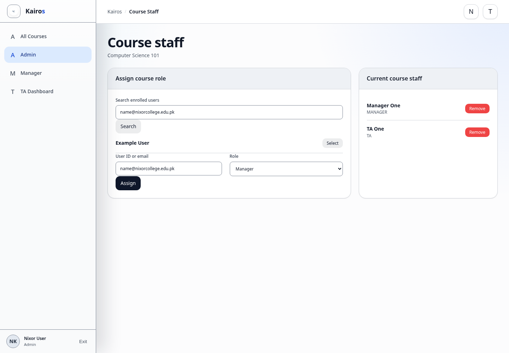

# Managing roles

## What this is for

Assign Managers and TAs to courses and choose the initial platform role for invited password accounts.

## How to do it

1. Open **Admin**.
2. Select the course under **All Courses**.
3. Find **Course staff**.
4. Search for the user or enter their user ID or email.
5. Choose **Manager** or **TA**.
6. Select **Assign**.
7. Use **Remove** to revoke a course-staff assignment.

## Screenshot

## Notes

- Only Admins can assign or remove course Managers and TAs.
- Platform role is also selected when inviting a local-password user.
- Use the lowest role required.
- Changing an existing user's platform-wide role is not shown as a separate control. **Confirm in Kairos before publishing.**
