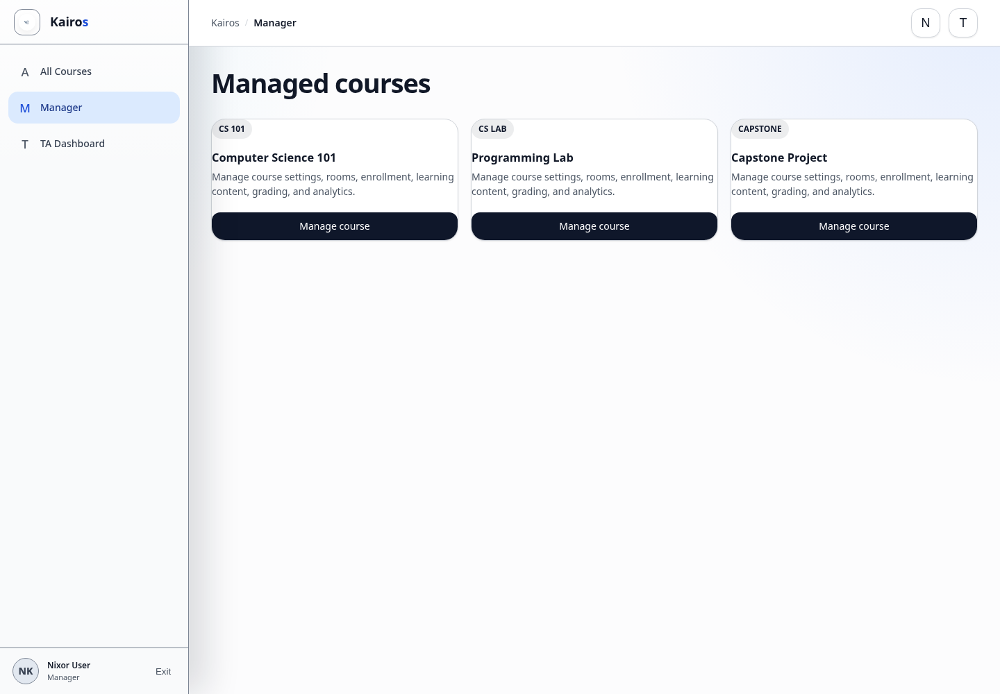

# Manager dashboard overview

## What this is for

Use the Manager area to manage assigned courses, rooms, enrollment, progress, learning content, grading, and analytics.

## How to do it

1. Select **Manager** from the Kairos menu.
2. Choose a course under **Managed courses**.
3. Review **Course settings**, **Rooms**, and **Enrollment**.
4. Use **Student progress** for roster progress.
5. Open the course itself for modules, assignments, quizzes, grading, and analytics.

## Screenshot

## Notes

- Only Managers and Admins can use Manager controls.
- Managers can manage only their assigned courses.
- Admins can access all courses.
