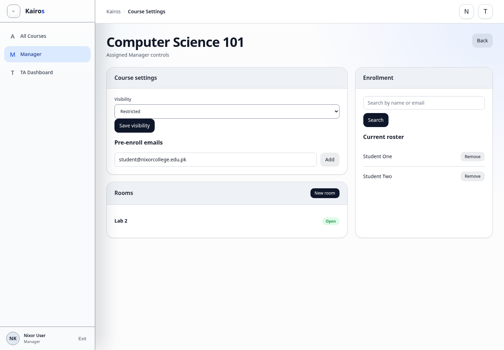

# Creating and editing courses

## What this is for

Understand which course setup actions are available to Managers and which require an Admin.

## How to do it

1. Ask an Admin to create a new course; the visible Manager dashboard does not include course creation.
2. Open **Manager** and select the assigned course.
3. Change **Visibility** when needed and select **Save visibility**.
4. Add pre-enroll email addresses when appropriate; existing accounts can accept the invitation from their dashboard.
5. Create or manage rooms.
6. Search for Students and manage the current roster.

## Screenshot

## Notes

- Only Admins can create, rename, or delete courses from the visible Admin controls.
- Managers edit settings only for assigned courses.
- Check the selected course before changing visibility or enrollment.
- Pre-enroll is for explicit invitations. Students still need to sign in with the invited email before the course appears as enrolled.
