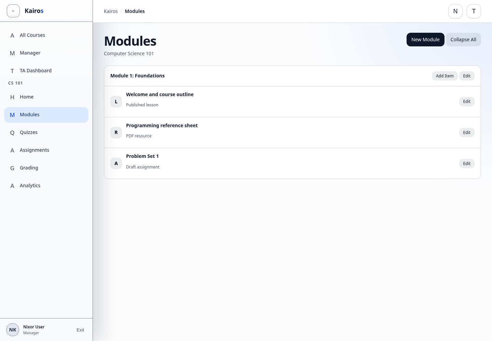

# Managing modules and resources

## What this is for

Organize course content into modules and add lessons, resources, assignments, or quizzes.

## How to do it

1. Open the managed course and select **Modules**.
2. Select **New Module**.
3. Enter the module name and create it.
4. Select **Add Item** inside the module.
5. Choose the item type and enter the requested details.
6. Use the item controls to edit, reorder, remove, publish, or delete where shown.
7. Reopen the Student view to confirm the published order.

## Screenshot

## Notes

- Only Managers and Admins can manage module content.
- Removing an item from a module may not delete the original assignment or quiz.
- Students see published content only.
- Confirm each external resource link before publishing.
