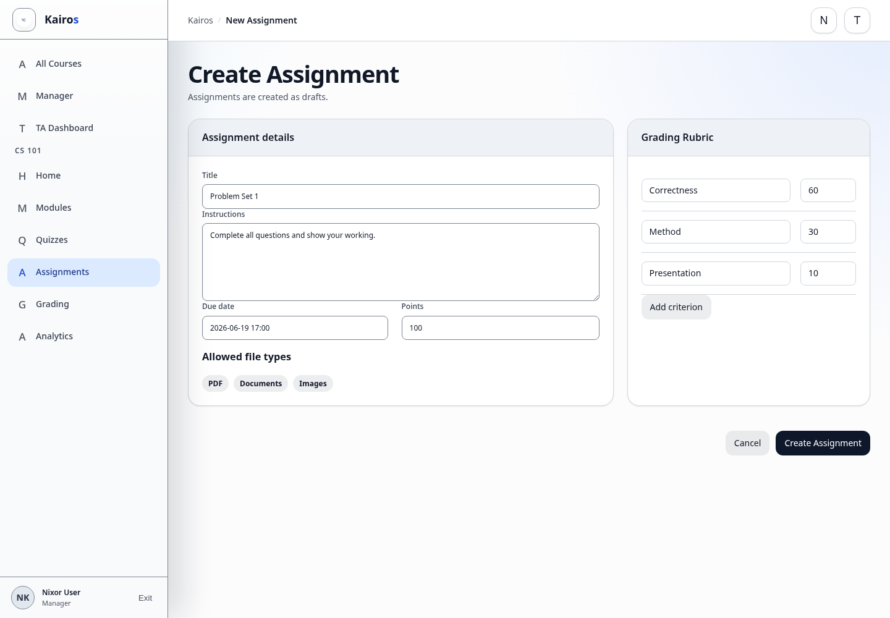

# Creating assignments

## What this is for

Create a draft assignment with instructions, submission rules, points, and an optional rubric.

## How to do it

1. Open the managed course and select **Assignments**.
2. Select **New Assignment**.
3. Enter the title, instructions, due date, points, and submission settings.
4. Choose the allowed file types and maximum size when file submission is used.
5. Add rubric criteria if needed.
6. Create the assignment.
7. Review the draft, then publish it when ready.

## Screenshot

## Notes

- Only Managers and Admins can create assignments.
- New assignments are created as drafts.
- Students cannot submit until the assignment is published and available.
- Check due dates, attempt limits, and file rules before publishing.
