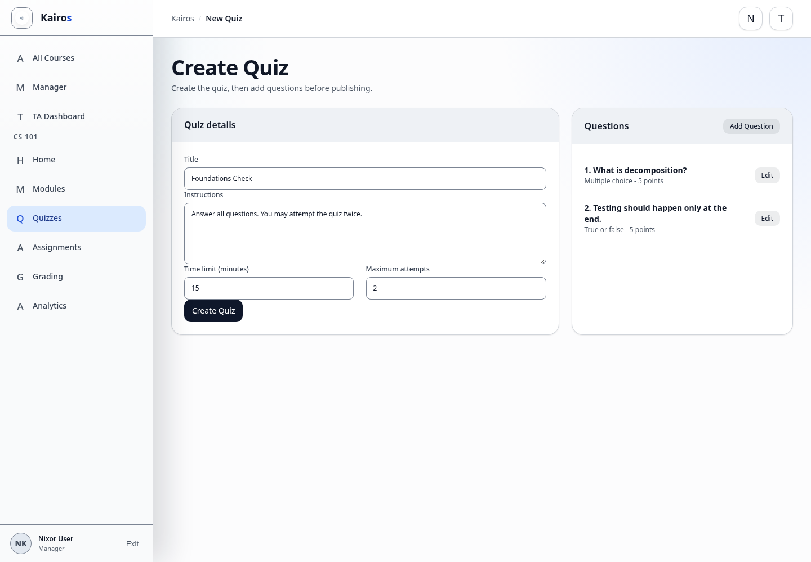

# Creating quizzes

## What this is for

Create a draft quiz, add questions, and publish it for Students.

## How to do it

1. Open the managed course and select **Quizzes**.
2. Select **New Quiz**.
3. Enter the title, instructions, availability, time limit, and attempt limit.
4. Create the quiz as a draft.
5. Open the quiz and select **Add Question**.
6. Add each question, answer choice, correct answer, and points as requested.
7. Select **Preview Quiz** to test the student-facing layout without creating a student attempt.
8. Select **Publish** when ready.

## Screenshot

## Notes

- Only Managers and Admins can create quizzes.
- A quiz should remain a draft until questions and scoring are checked.
- Managers and Admins can use **Preview Quiz** to review published or draft quiz content without creating a student attempt.
- Previewing a quiz does not submit answers or count against attempt limits.
- Short-answer questions may require manual review.
- Check the availability window and time limit before publishing.
