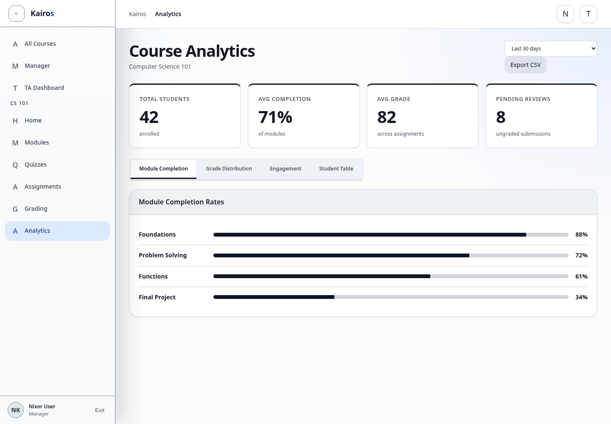

# Viewing analytics

## What this is for

Review course participation, completion, grades, pending reviews, engagement, and Student activity.

## How to do it

1. Open the managed course.
2. Select **Analytics**.
3. Choose the time period.
4. Review the summary metrics.
5. Open **Module Completion**, **Grade Distribution**, **Engagement**, or **Student Table**.
6. Search the Student table when investigating an individual record.
7. Select **Export CSV** when a download is needed.

## Screenshot

## Notes

- Analytics is available to Managers and Admins.
- TAs and Students do not see the Analytics page.
- Check the selected time period before interpreting results.
- Pending reviews are submissions still awaiting grading.
