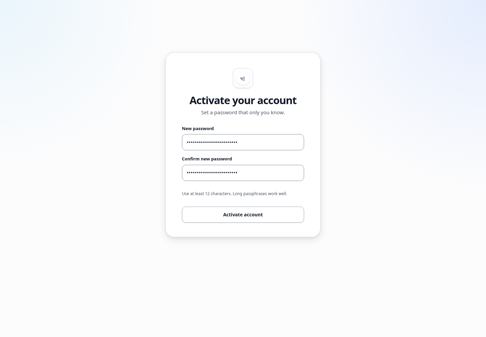

# Account activation and password reset

## What this is for

Activate an Admin-invited password account or choose a new password after requesting a reset.

## How to do it

1. Open the latest activation or reset email from Kairos.
2. Select the link in the email.
3. Enter a new password of at least 12 characters.
4. Enter the same password again.
5. Select **Activate account** or **Reset password**.
6. Return to Kairos and sign in with your username or email.

## Screenshot

## Notes

- Each activation or reset email should be used only once.
- A newer email replaces an older unused activation email.
- Admins do not create or view your password.

## Troubleshooting

- Ask an Admin to resend activation if the link is no longer accepted.
- Use **Forgot password?** on the login page for an active password account.
- Check spam or junk mail if the email is missing.
