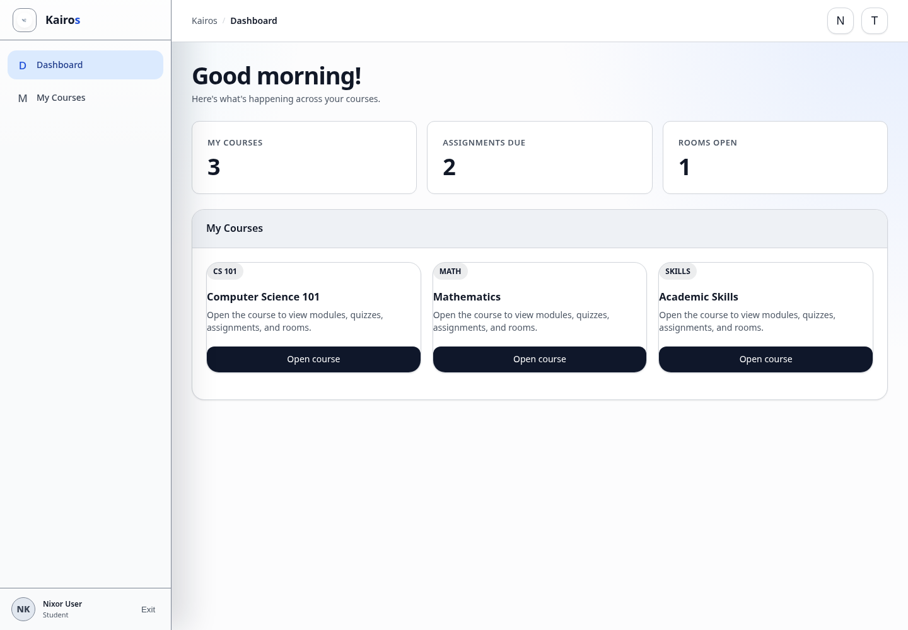

# Dashboard overview

## What this is for

The dashboard is the starting point for your courses, rooms, progress, and role tools.

## How to do it

1. Review the summary cards at the top of the dashboard.
2. Find your course under **My Courses**.
3. Select the course card to open its home page.
4. Use **Available Courses** only when a course is offered for joining.
5. Use the left menu for **TA Dashboard**, **Manager**, or **Admin** when your role allows it.

## Screenshot

## Notes

- The menu changes according to your role.
- A course may be visible as a preview before you are enrolled.
- On a phone, use the menu button to open the sidebar.
