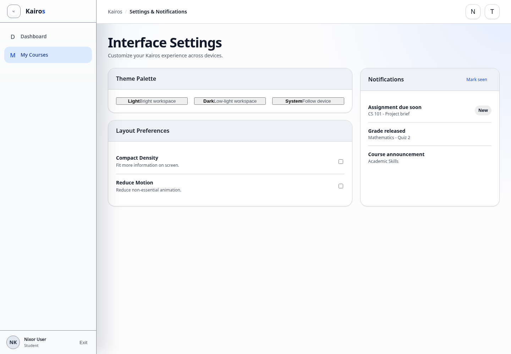

# Settings and notifications

## What this is for

Change the Kairos appearance, reduce motion, and review course notifications.

## How to do it

1. Open **Settings** from Kairos.
2. Choose a theme under **Theme Palette**.
3. Turn **Compact Density** or **Reduce Motion** on or off as needed.
4. Select the notification bell to view recent updates.
5. Select **Mark seen** after reviewing notifications.
6. Password-account users can also change their password in **Account Security**.

## Screenshot

## Notes

- Settings follow your account across supported devices.
- Notifications can include announcements, due reminders, and released grades.
- Linking a Google account is available only when shown in **Account Security**.
