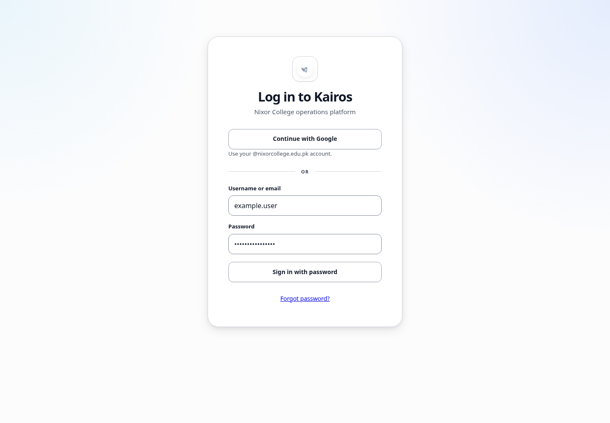

# Common issues

## What this is for

Quick checks for common login, course, page, and file problems.

## How to do it

1. Refresh the page once.
2. Confirm you are signed in with the correct account.
3. Return to **All Courses** and reopen the course.
4. Check whether the action is allowed for your role.
5. For uploads, check the allowed file types and maximum size shown on the assignment.
6. If the problem continues, note the page, course, and exact message before contacting support.

## Screenshot

## Notes

- Students cannot open Manager or Admin controls.
- TAs can grade only where grading access is assigned.
- Some resources open in a separate viewer or browser tab.

## Troubleshooting

- **Course missing:** contact the course Manager or an Admin.
- **Activation email missing:** ask an Admin to resend it.
- **Upload rejected:** use a listed file type within the shown size limit.
- **Page remains blank:** sign out, sign in again, and reopen the page.
