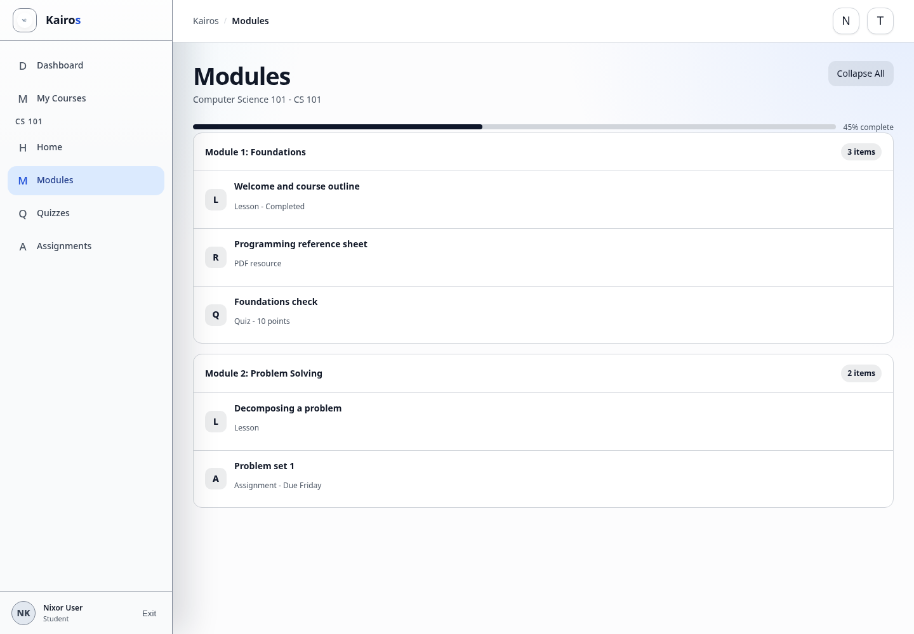

# Using modules and resources

## What this is for

Work through lessons, resources, quizzes, and assignments in the order set by course staff.

## How to do it

1. Open a course.
2. Select **Modules** in the course menu.
3. Expand a module to view its items.
4. Select a lesson or resource to open it.
5. Use the provided viewer, download option, or external link as shown.
6. Return to **Modules** to continue to the next item.

## Screenshot

## Notes

- Published items are visible to Students; drafts are not.
- Resources may be PDFs, documents, slides, videos, or external links.
- Some links open in a new tab.

## Troubleshooting

- If a preview does not load, use the available open or download option.
- If an item is missing, check whether it has been published with the course Manager.
