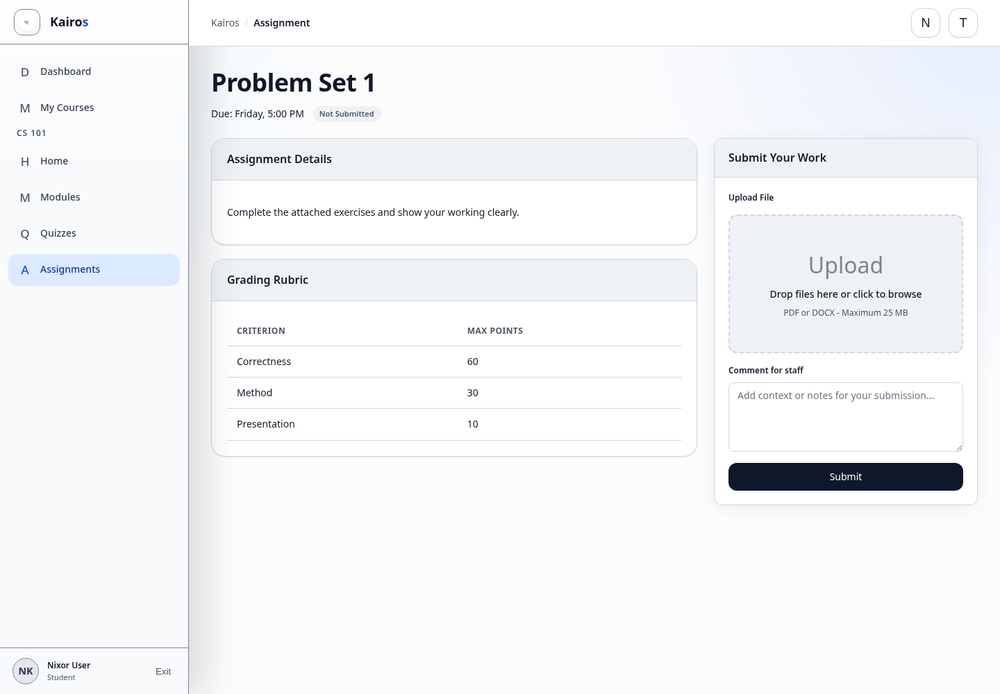

# Submitting assignments

## What this is for

Submit a file, written answer, or link according to the assignment instructions.

## How to do it

1. Open the course and select **Assignments**.
2. Select the assignment.
3. Read the details, due date, allowed file types, size limit, and rubric.
4. Add the required file, answer, or link.
5. Optionally add a **Comment for staff**.
6. Select **Submit**.
7. Confirm that the status changes to **Submitted**.

## Screenshot

## Notes

- A staff comment is visible to graders.
- Use **Submit New Version** only when another attempt is allowed.
- Check **Submission History** to confirm earlier versions.

## Troubleshooting

- A file outside the listed type or size limit will be rejected.
- Do not close the page until the submitted confirmation appears.
