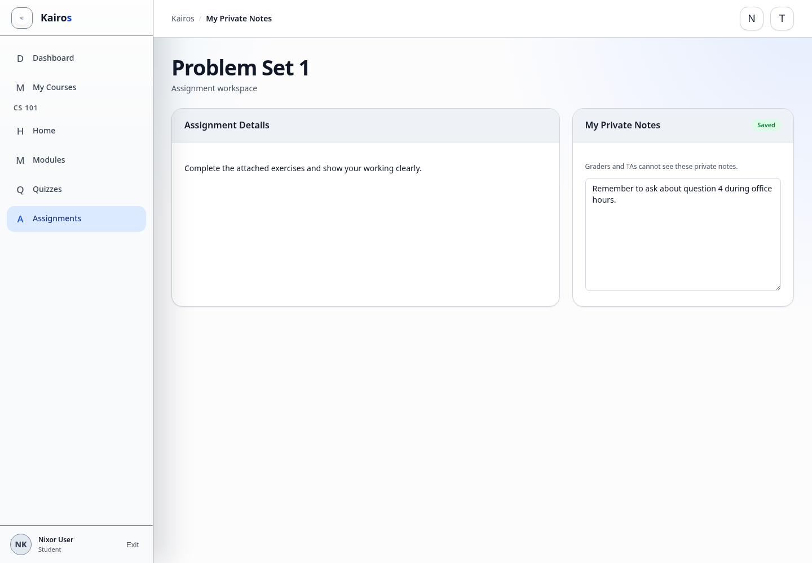

# Adding assignment notes

## What this is for

Keep personal notes beside an assignment without sending them to course staff.

## How to do it

1. Open the course and select **Assignments**.
2. Open the assignment.
3. Find **My Private Notes**.
4. Type or update your note.
5. Wait until the status shows **Saved**.

## Screenshot

## Notes

- These notes are private to the Student.
- TAs, Managers, and Admins cannot use this panel to read the note.
- Private notes are separate from **Comment for staff**.

## Troubleshooting

- If the status shows a save error, keep the page open and try the edit again after refreshing.
