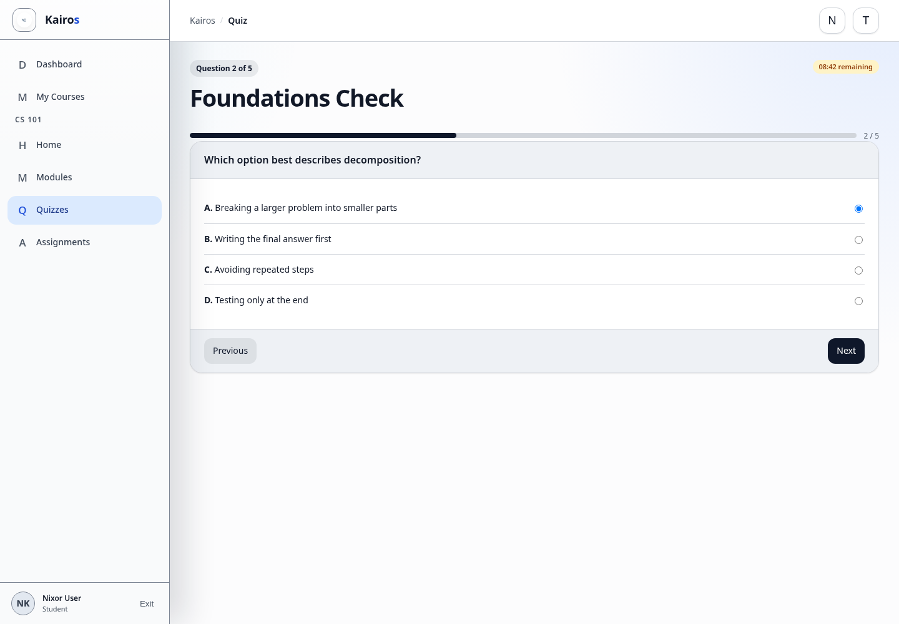

# Taking quizzes

## What this is for

Start, answer, and submit a published course quiz.

## How to do it

1. Open the course and select **Quizzes**.
2. Select the quiz and read its time limit and attempt limit.
3. Select **Start Attempt**.
4. Click anywhere on an answer card, or use the connected radio/checkbox control, to select an answer.
5. Use **Previous**, **Next**, or the numbered question indicators to move.
6. Review the indicators for unanswered required items.
7. Select **Submit Quiz** on the final question.
8. Review the result, then select **View History** to revisit a completed attempt.
9. Select **Review** on a completed attempt to see your selected answer, the correct answer, and any explanation your teacher added.

## Screenshot

## Notes

- A timed quiz continues counting down after it starts.
- Some answers may require manual grading before the final score is complete.
- Required questions must be answered before the quiz can be submitted.
- Correct answers and explanations are shown only after an attempt is submitted.
- You can review only your own completed attempts.
- Do not refresh or close the page during an active attempt unless necessary.
- If live updates are reconnecting, continue taking the quiz; quiz answers and submission use the normal Kairos API rather than the realtime connection.

## Troubleshooting

- If the quiz is unavailable, check its availability time or contact the course Manager.
