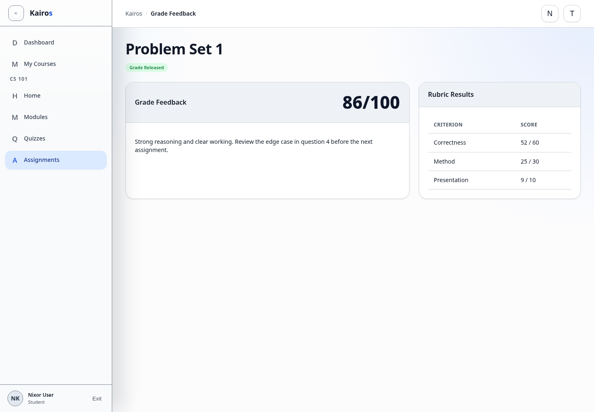

# Viewing grades and feedback

## What this is for

Review a released assignment grade, rubric result, and feedback from course staff.

## How to do it

1. Open the course and select **Assignments**.
2. Open the graded assignment.
3. Find the released grade beside the assignment status.
4. Review **Grade Feedback**.
5. Expand the rubric to compare each criterion and score.
6. Review **Submission History** for the graded version.

## Screenshot

## Notes

- Students see grades only after staff release them.
- Draft grades and private staff notes are not shown to Students.
- Quiz results appear on the quiz result or attempt-history page.
