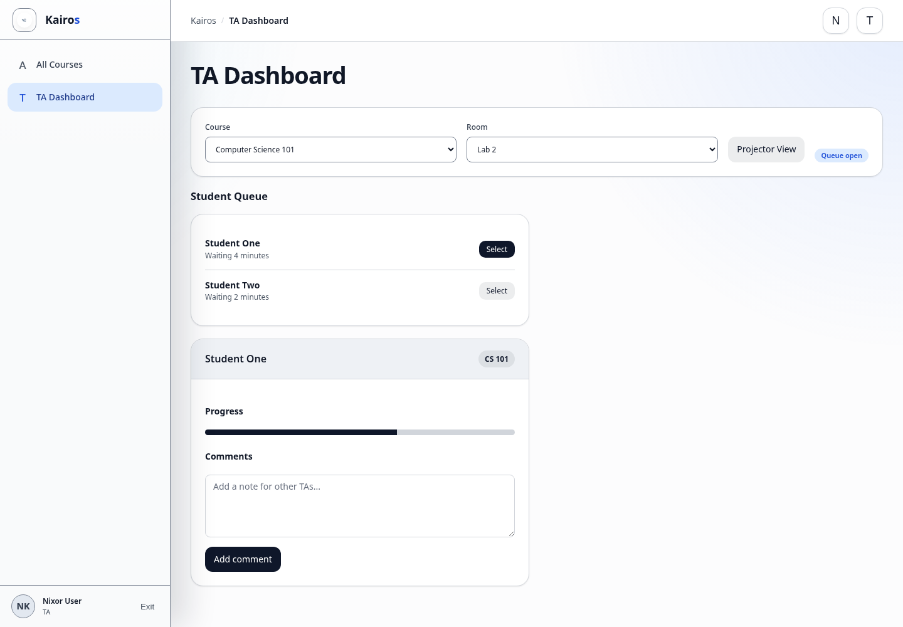

# Viewing assigned courses

## What this is for

Find courses where you have TA access and open the correct course tools.

## How to do it

1. Open **TA Dashboard**.
2. Open the **Course** list.
3. Choose the assigned course.
4. Select a room when working with a live queue.
5. Use **All Courses** to open the course home, modules, assignments, or quizzes.
6. Use **Grading** inside the course when grading access is available.
7. Open a quiz and select **Preview Quiz** when you need to check quiz-taking layout without submitting a student attempt.

## Screenshot

## Notes

- A course may appear differently when you are a TA in one course and a Student in another.
- When quiz grading access is available, **Preview Quiz** opens quiz content for review without creating a student attempt.
- Previewing a quiz does not submit answers or count against attempt limits.
- Contact a Manager or Admin if an assigned course is missing.
