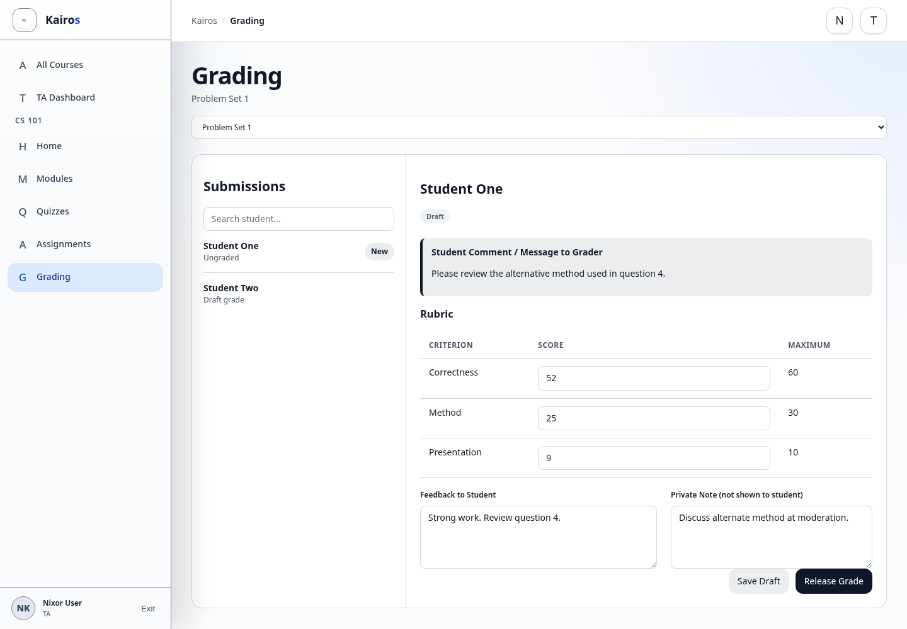

# Releasing or viewing feedback

## What this is for

Save feedback as a draft or release it with the grade to the Student.

## How to do it

1. Complete the rubric scores and **Feedback to Student**.
2. Select **Save Draft** if the work needs review.
3. Select **Release Grade** when the grade and feedback are ready.
4. Confirm the status changes to **Released**.
5. Reopen the submission to review the saved feedback.

## Screenshot

## Notes

- Released feedback becomes visible to the Student.
- Draft feedback is not visible to the Student.
- Use release only after checking the score, rubric, and wording.
- Managers may release all draft grades for a course; TAs release individual grades where allowed.
